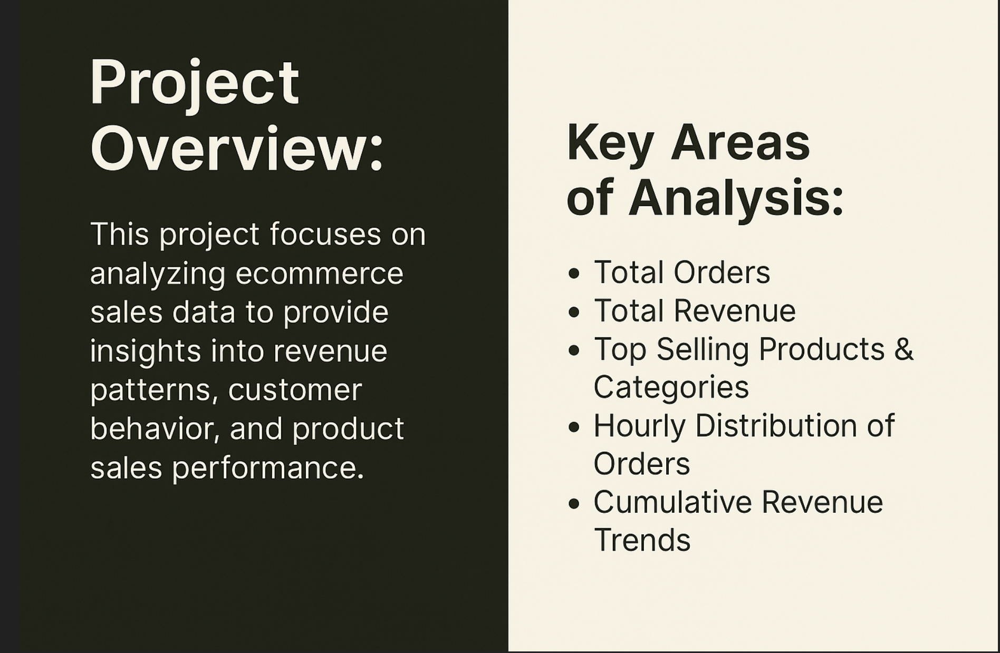
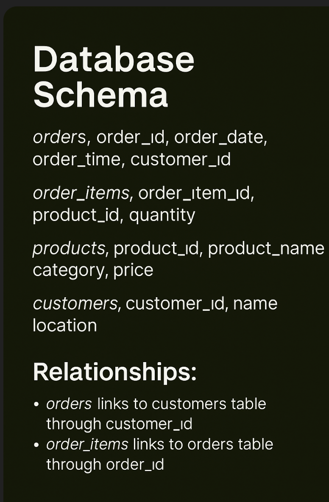
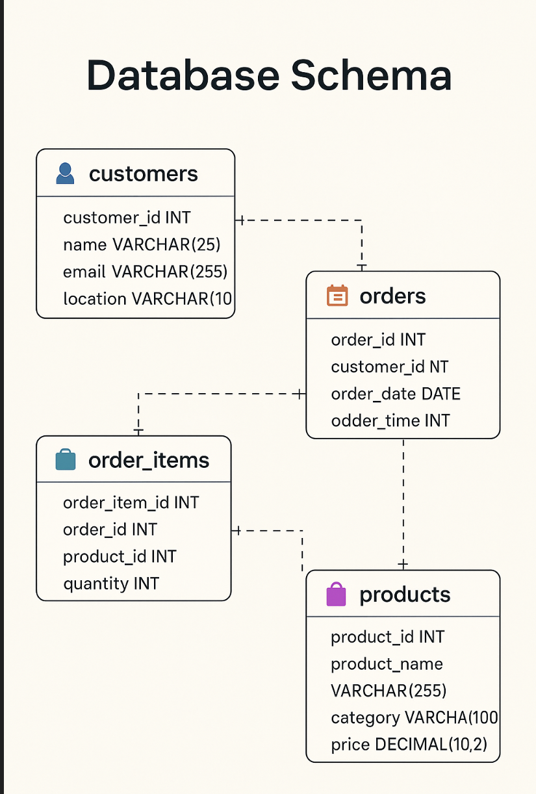
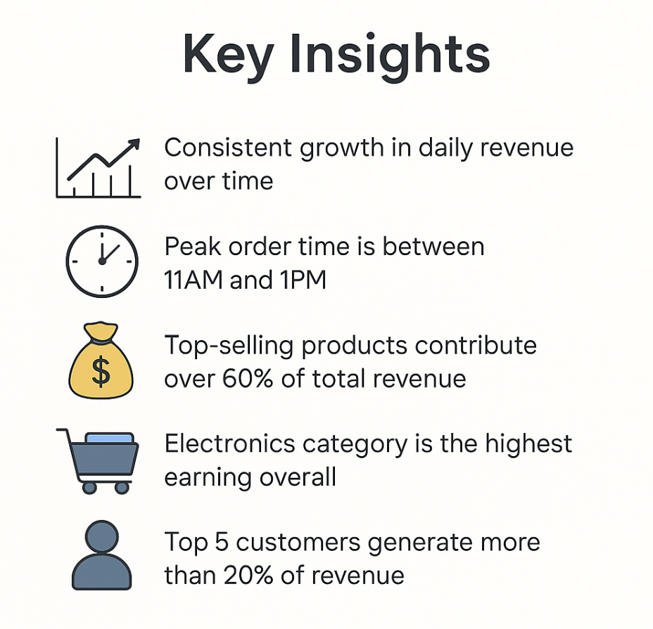
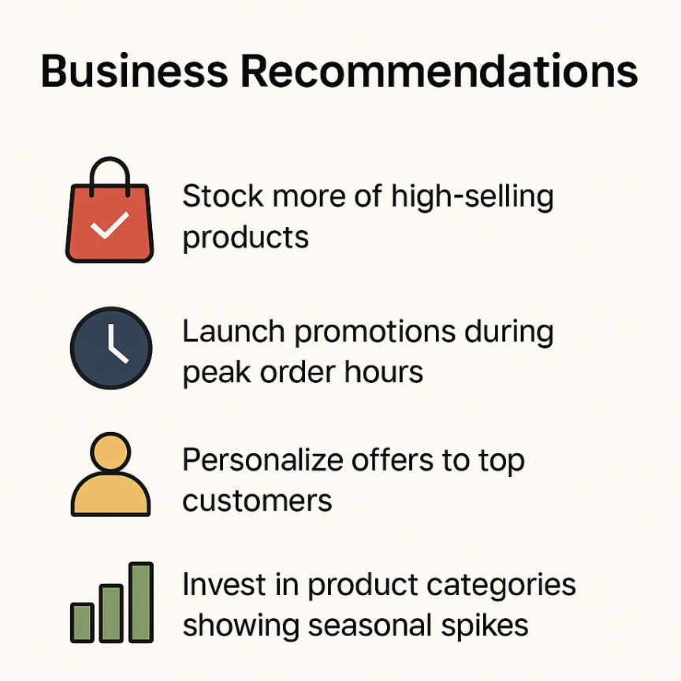

# 🛍️ Ecommerce Sales Analysis using SQL

## 📖 Project Description  
This project analyzes ecommerce sales data using **SQL** to extract meaningful business insights like revenue trends, customer behavior, and product performance.  
It includes powerful SQL queries and clean visual storytelling slides — perfect for showcasing on LinkedIn and GitHub portfolios.

---

## 🖼️ Visual Overview

### 📌 Cover Slide  


### 🎯 Project Objective & Key Analysis Areas  


### 🧱 Database Schema  


### 🗺️ ER Diagram  


### 📊 Revenue by Product  


### 🥧 Sales by Category  


### ⏰ Orders by Hour  


### 💵 Cumulative Revenue  


### 🧠 Key Insights  


### 💡 Business Recommendations  


---

## 🗂️ Dataset Overview

- `order_items.csv` – Contains details of products per order  
- `products.csv` – Product names, prices, and categories  
- `customers.csv` – Customer information  
- `orders.csv` – Orders placed (date, time, customer ID)

---

## 🔍 Key SQL Analysis & Insights

- ✅ Total Orders Count  
- ✅ Total Revenue Calculation  
- ✅ Total Customers Count  
- ✅ Top Product by Quantity Sold  
- ✅ Revenue by Product  
- ✅ Revenue by Category  
- ✅ Orders by Hour  
- ✅ Top 5 Customers by Revenue  
- ✅ Cumulative Revenue Trend

---

## 💻 Tools & Technologies Used

- SQL (Structured Query Language) – MySQL  
- MySQL Workbench (for ERD and queries)  
- Canva 

---

## ▶️ How to Use

1. Clone the repository:
```bash
git clone https://github.com/San7122/End_End_-_SQL_Ecommerce-sales-analysis.git
