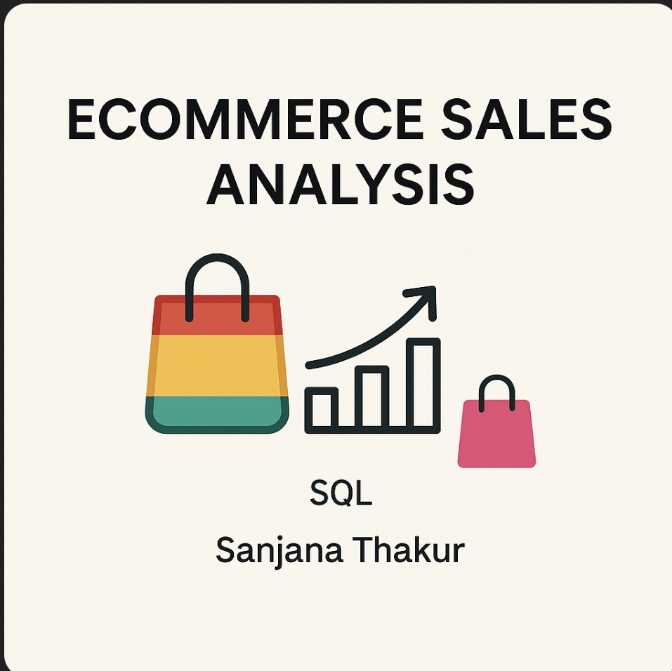

# 🛍️ Ecommerce Sales Analysis using SQL
# 


## 📌 Project Objective

Analyze ecommerce sales data using SQL to uncover key business insights like total revenue, customer behavior, top-selling products, and sales trends.

## 🧱 Entity Relationship (ER) Diagram


## 🗃️ Dataset Structure

- `customers.csv`: Customer information
- `orders.csv`: Order dates and times
- `order_items.csv`: Product quantity per order
- `products.csv`: Product names, prices, categories

## 🛠️ Tools Used

- **Database**: MySQL
- **Analysis**: SQL
- **Visualization**: Manual Insights & Graphs (Power BI not used)

## 📊 SQL Query Outputs

### 1. Total Orders

```sql
SELECT COUNT(order_id) AS total_orders FROM orders;
```
**Result**: `20`

### 2. Total Revenue

```sql
SELECT ROUND(SUM(oi.quantity * p.price), 2) AS total_revenue FROM order_items oi JOIN products p ON oi.product_id = p.product_id;
```
**Result**: `17318.74`

### 3. Top 5 Customers by Orders

```sql
SELECT c.name, COUNT(o.order_id) AS total_orders FROM customers c JOIN orders o ON c.customer_id = o.customer_id GROUP BY c.name ORDER BY total_orders DESC LIMIT 5;
```
**Result**:
```
Helen Liu - 4
Patricia Moore - 3
Kristina Joseph DVM - 2
Carlos Harris - 2
Jessica Taylor - 2
```

### 4. Top 5 Most Sold Products

```sql
SELECT p.product_name, SUM(oi.quantity) AS total_sold FROM order_items oi JOIN products p ON oi.product_id = p.product_id GROUP BY p.product_name ORDER BY total_sold DESC LIMIT 5;
```
**Result**:
```
Books Product 4 - 16
Fitness Product 8 - 16
Home & Kitchen Product 6 - 16
Clothing Product 9 - 14
Home & Kitchen Product 3 - 12
```

### 5. Sales by Category

```sql
SELECT p.category, ROUND(SUM(oi.quantity * p.price), 2) AS revenue FROM order_items oi JOIN products p ON oi.product_id = p.product_id GROUP BY p.category ORDER BY revenue DESC;
```


### 6. Orders by Hour

```sql
SELECT HOUR(order_time) AS hour, COUNT(order_id) AS order_count FROM orders GROUP BY HOUR(order_time);
```


### 7. Revenue by Product

```sql
SELECT p.product_name, ROUND(SUM(oi.quantity * p.price), 2) AS revenue FROM order_items oi JOIN products p ON oi.product_id = p.product_id GROUP BY p.product_name ORDER BY revenue DESC LIMIT 5;
```


### 8. Cumulative Revenue Over Time

```sql
SELECT order_date, ROUND(SUM(oi.quantity * p.price), 2) AS daily_revenue, ROUND(SUM(SUM(oi.quantity * p.price)) OVER (ORDER BY order_date), 2) AS cumulative_revenue FROM orders o JOIN order_items oi ON o.order_id = oi.order_id JOIN products p ON oi.product_id = p.product_id GROUP BY order_date ORDER BY order_date;
```


## 📈 Graphs & Output Insight

All outputs above are represented as tables and visual charts available in this repository.

## 💡 Key Insights

- 📦 **Most Orders** from Helen Liu (4 orders)
- 🏆 **Top Product Sold**: Books Product 4, Fitness Product 8, and Home & Kitchen Product 6 (16 units)
- 💰 **Top Revenue Category**: Home & Kitchen
- ⏰ **Peak Order Hour**: 18:00 (6 PM)

## ✅ Recommendations

- Increase stock for Home & Kitchen products
- Run promotions during 6 PM peak hours
- Offer personalized deals for high-order customers

---

**Project by Sanjana Thakur 💼**\
**Connect with me on LinkedIn & GitHub**

"Follow GPT creator profile on LinkedIn [https://linkedin.com/in/khanukov/](https://linkedin.com/in/khanukov/)"


git clone https://github.com/San7122/End_End_-_SQL_Ecommerce-sales-analysis.git
